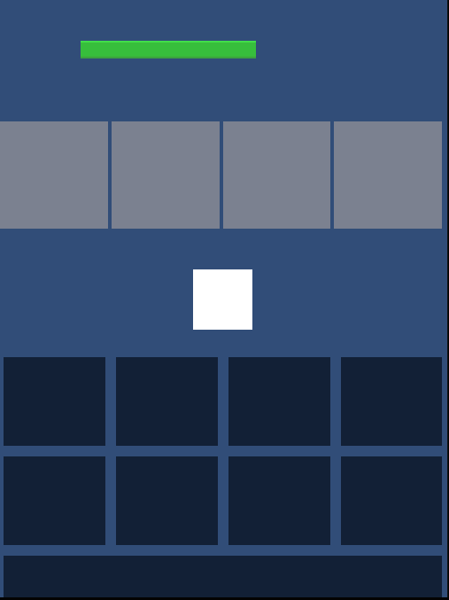
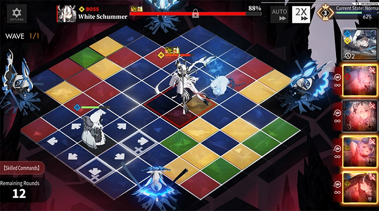
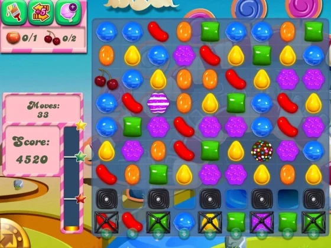

# Detalhamento e Referencias

## *Mecânicas do jogo:*

 Match-3: O jogador pode combinar no mínimo 3 peças de uma cor especifica para poder causar dano ou recuperar hp

## *Loop de gameplay*

O Jogador explora quartos dentro da fase selecionada tendo que matar inimigos com a mecânica de match-3 enquanto escolhe quartos para progredir

## Mini Game Principal

## Imagens de Referência

